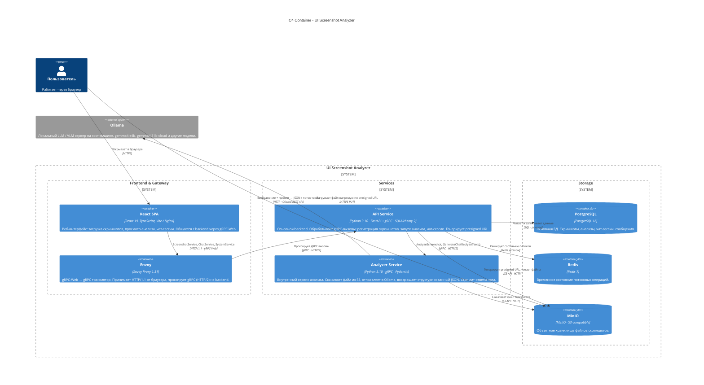

# C4 Container Diagram - UI Screenshot Analyzer

C4 Container раскрывает внутренние контейнеры системы, их технологии и способы взаимодействия.

## Диаграмма



## Контейнеры

| Контейнер            | Технология                  | Порты                                | Описание                                                        |
|----------------------|-----------------------------|--------------------------------------|-----------------------------------------------------------------|
| **React SPA**        | React 19, TypeScript, Nginx | `3000`                               | Фронтенд, раздаётся Nginx в production-сборке                   |
| **Envoy**            | Envoy Proxy 1.31            | `8080`                               | gRPC-Web → gRPC прокси; единственная точка входа для gRPC       |
| **API Service**      | Python 3.10, FastAPI, gRPC  | `8000` (HTTP), `50051` (gRPC)        | Основной backend: бизнес-логика, БД, S3, оркестрация            |
| **Analyzer Service** | Python 3.10, gRPC           | `8010` (HTTP health), `50061` (gRPC) | Изолированный сервис анализа; единственный, кто вызывает Ollama |
| **PostgreSQL**       | PostgreSQL 16               | `5432`                               | Основное хранилище данных; миграции через Alembic               |
| **Redis**            | Redis 7                     | `6379`                               | Временное состояние; потенциальная очередь задач                |
| **MinIO**            | MinIO S3                    | `9000` (API), `9001` (консоль)       | Объектное хранилище файлов скриншотов                           |

## Внешние системы

| Система    | Где запускается                            | Протокол  |
|------------|--------------------------------------------|-----------|
| **Ollama** | Хост-машина (`host.docker.internal:11434`) | HTTP REST |

## Потоки данных

### Загрузка скриншота
```
Пользователь → API Service   (gRPC: CreateScreenshotUploadUrl)
API Service  → MinIO          (генерация presigned URL)
API Service  → Пользователь  (presigned URL)
Пользователь → MinIO          (PUT файла напрямую)
Пользователь → API Service   (gRPC: RegisterScreenshot)
API Service  → PostgreSQL     (INSERT screenshot)
```

### Анализ скриншота
```
Пользователь  → API Service   (gRPC: StartScreenshotAnalysis)
API Service   → Analyzer      (gRPC: AnalyzeScreenshot)
Analyzer      → MinIO          (скачать файл)
Analyzer      → Ollama         (HTTP: изображение + промпт)
Ollama        → Analyzer       (структурированный JSON)
Analyzer      → API Service   (AnalyzeScreenshotResponse)
API Service   → PostgreSQL     (INSERT analysis)
```

### Чат
```
Пользователь  → API Service   (gRPC stream: SendChatMessage)
API Service   → PostgreSQL     (INSERT user message)
API Service   → Analyzer      (gRPC stream: GenerateChatReply)
Analyzer      → Ollama         (HTTP stream: промпт + контекст анализа)
Ollama        → Analyzer       (потоковый текст)
Analyzer     ↪ API Service   ↪ Пользователь  (стриминг чанков)
API Service   → PostgreSQL     (INSERT assistant message)
```
