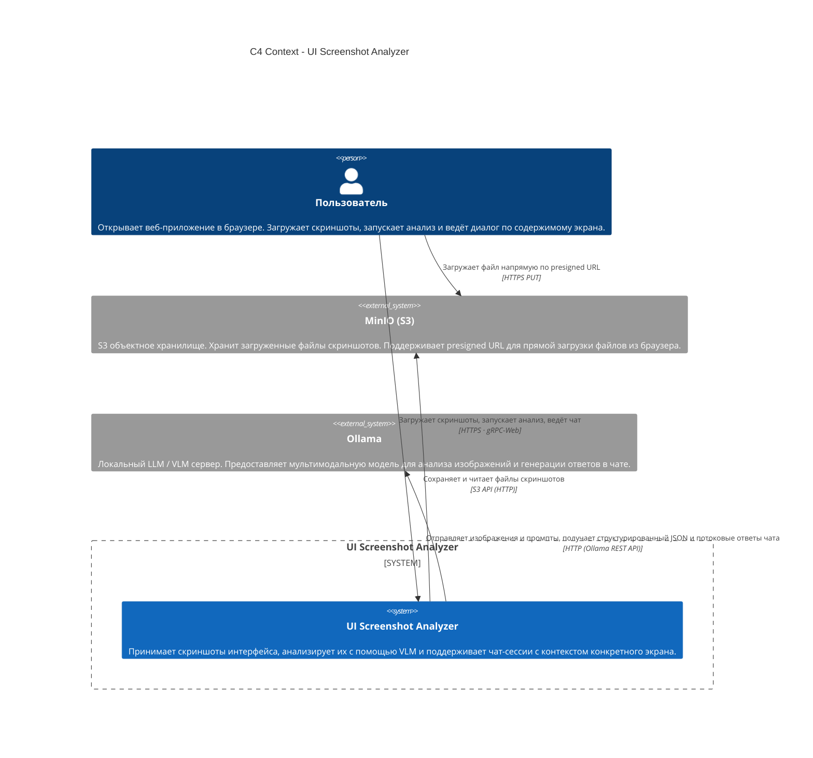

# C4 Context Diagram - UI Screenshot Analyzer

C4 Context отображает систему целиком и ее связи.

## Диаграмма

## Участники

| Элемент                    | Тип             | Описание                                                                                                                       |
|----------------------------|-----------------|--------------------------------------------------------------------------------------------------------------------------------|
| **Пользователь**           | Person          | Единственный тип пользователя в MVP (аутентификация не реализована). Работает через браузер.                                   |
| **UI Screenshot Analyzer** | Software System | Весь сервис: фронтенд, API, анализатор, БД.                                                                                    |
| **Ollama**                 | External System | Запускается локально на хост-машине. Предоставляет HTTP API для работы с мультимодальными моделями.                            |
| **MinIO (S3)**             | External System | S3-совместимое хранилище. В локальной разработке - контейнер MinIO. В production заменяется на AWS S3 или другой S3-провайдер. |

## Ключевые архитектурные особенности

- **Прямая загрузка в S3** - браузер загружает файл напрямую в MinIO по presigned URL, минуя backend.
- **Ollama запускается локально** - модель работает на хост-машине, контейнеры обращаются к ней через `host.docker.internal:11434`. Интернет не требуется.
- **gRPC-Web через Envoy** - браузер не может использовать gRPC напрямую; Envoy транслирует gRPC-Web (HTTP/1.1) во внутренний gRPC (HTTP/2).
