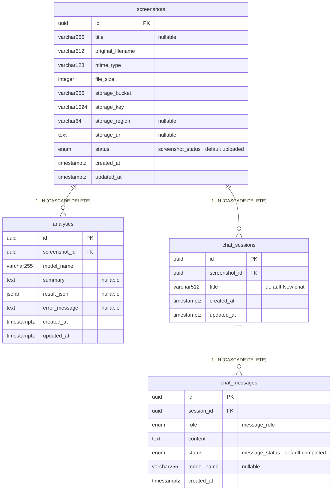

# Database Schema - Entity Relationship Diagram

Диаграмма описывает схему PostgreSQL базы данных сервиса UI Screenshot Analyzer.

## ENUMs

| Тип                 | Значения                                    |
|---------------------|---------------------------------------------|
| `screenshot_status` | `uploaded`, `analyzing`, `completed`, `failed` |
| `message_role`      | `user`, `assistant`, `system`               |
| `message_status`    | `completed`, `streaming`, `failed`          |

## ERD



## Индексы

| Таблица        | Индекс                           | Колонки          |
|----------------|----------------------------------|------------------|
| `analyses`     | `ix_analyses_screenshot_id`      | `screenshot_id`  |
| `chat_sessions`| `ix_chat_sessions_screenshot_id` | `screenshot_id`  |
| `chat_messages`| `ix_chat_messages_session_id`    | `session_id`     |

## Описание связей

| Связь                             | Тип                        | ON DELETE | Примечание                                                                             |
|-----------------------------------|----------------------------|-----------|----------------------------------------------------------------------------------------|
| `screenshots` → `analyses`        | **один ко многим** (1 : N) | CASCADE   | Один скриншот - много запусков анализа; в приложении берётся последний по `created_at` |
| `screenshots` → `chat_sessions`   | **один ко многим** (1 : N) | CASCADE   | Один скриншот - много чат-сессий                                                       |
| `chat_sessions` → `chat_messages` | **один ко многим** (1 : N) | CASCADE   | Одна сессия - упорядоченный список сообщений (`user` / `assistant` / `system`)         |


## Хранилище файлов

Физические файлы скриншотов хранятся в **S3-совместимом хранилище** (MinIO в локальной разработке). В БД хранится только ссылка:

| Поле             | Описание                            |
|------------------|-------------------------------------|
| `storage_bucket` | Имя бакета (`screenshots`)          |
| `storage_key`    | Путь к объекту внутри бакета        |
| `storage_region` | Регион (опционально, `us-east-1`)   |
| `storage_url`    | Полный публичный URL (для отладки)  |

## Миграции

Схема управляется через **Alembic**. Миграции находятся в [`backend/alembic/versions/`](../backend/alembic/versions/).

```bash
# Применить все миграции
docker compose exec backend alembic upgrade head

# Создать новую миграцию
docker compose exec backend alembic revision --autogenerate -m "description"
```
