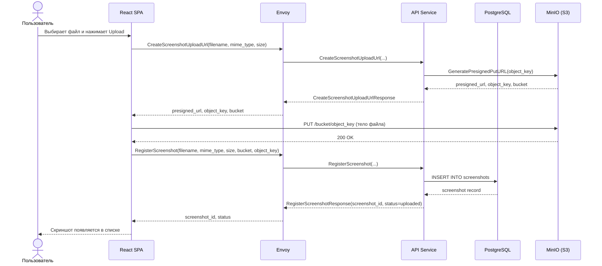
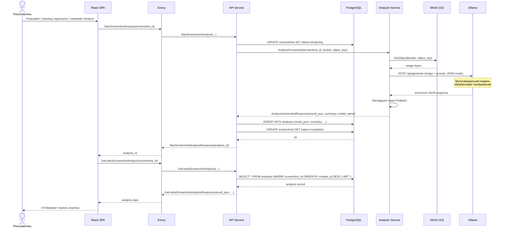
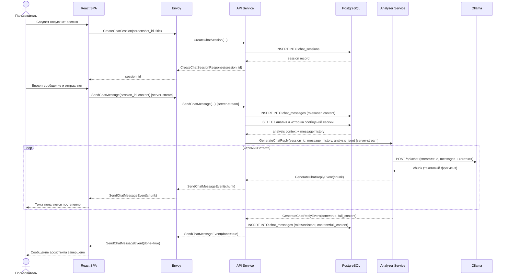

# UML Sequence Diagrams - UI Screenshot Analyzer

Три основных потока: загрузка скриншота, анализ и чат.

---

## 1. Загрузка скриншота

Файл загружается напрямую в S3 из браузера, минуя backend.

---

## 2. Анализ скриншота

Backend делегирует анализ внутреннему Analyzer Service, который обращается к Ollama.

---

## 3. Чат по скриншоту

Ответ ассистента стримится чанками через server-streaming gRPC.

